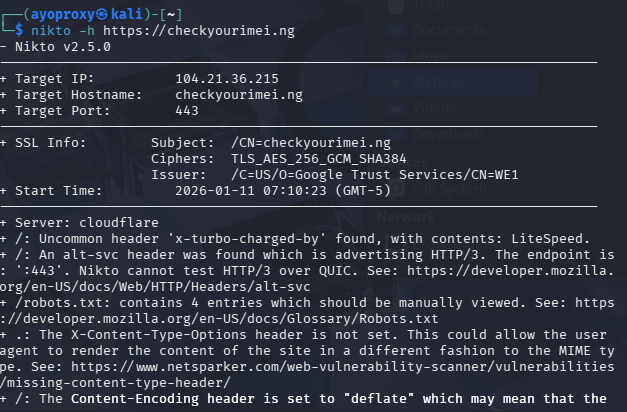
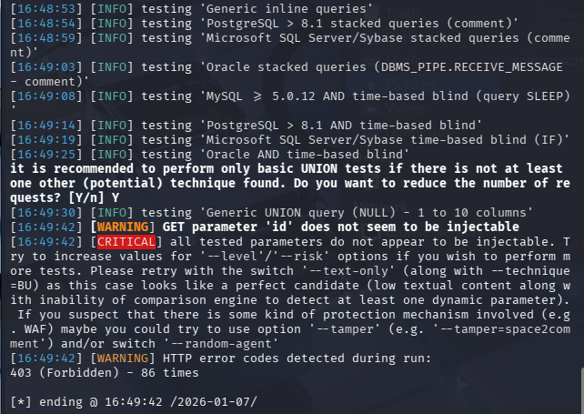

# security-hardening-case-study
Secured a live PHP utility platform using Cloudflare WAF and LiteSpeed hardening. Mitigated OWASP Top 10 risks and validated defenses using Nmap and SQLMap. Successfully blocked 80+ injection attempts and achieved a zero-vulnerability rating in final assessments

⚠️ Security Notice: The link provided (checkyourimei.ng) is a live production environment. While this repository documents security testing, unauthorized scanning or attacking of the live domain is strictly prohibited. If you are a recruiter or hiring manager, please browse the site normally.


# 🛡️ Case Study: Hardening a Live PHP Web Application
**Project:** [CheckYourIMEI.ng](https://checkyourimei.ng) | **Role:** Lead Developer & Security Engineer


## 📌 Executive Summary
This project demonstrates the full-cycle security hardening of a custom PHP application. Starting with a vulnerable legacy codebase, I implemented a defense-in-depth strategy covering Network, Server, and Application layers. The final result is a production-grade platform scoring "A" on security headers and successfully repelling automated SQL injection and XSS attacks.

---

## ⚔️ The Challenge
The initial assessment of the platform revealed critical vulnerabilities common in custom PHP applications:
* **Vulnerability to SQL Injection (SQLi)** via unprotected GET parameters.
* **Information Leakage** (Server signatures and version numbers exposed).
* **Weak Session Management** (Cookies accessible via JavaScript).
* **Susceptibility to Automated Scanners** (Botnets and scrapers).

---

## 🛡️ Defense Strategy (Blue Team)

### 1. Server & Network Layer
* **WAF Implementation:** Deployed **Cloudflare** to mask the origin IP and mitigate DDoS attacks.
* **Custom Firewall (.htaccess):** Engineered strict Apache/LiteSpeed rules to block malicious query strings and aggressive User Agents.
    ```apache
    # Example: Blocking SQL Injection patterns
    RewriteCond %{QUERY_STRING} (union.*select|insert.*into|delete.*from|drop.*table) [NC]
    RewriteRule ^(.*)$ - [F,L]
    ```
* **Header Hardening:** Implemented strict security headers to prevent Clickjacking and MIME sniffing.
    * `Strict-Transport-Security` (HSTS)
    * `X-Frame-Options: SAMEORIGIN`
    * `X-Content-Type-Options: nosniff`

### 2. Application Layer (AppSec)
* **Secure Database Access:** Refactored legacy queries to use **PDO Prepared Statements**, eliminating SQLi risks.
* **Session Hardening:** Enforced `HttpOnly`, `Secure`, and `SameSite` flags on session cookies to mitigate XSS and CSRF.
* **Input Sanitization:** Applied `htmlspecialchars()` encoding on all user-facing outputs.

---

## 🎯 The Assessment (Red Team)
To verify the defenses, I conducted a self-authorized penetration test using **Kali Linux**.

### Phase 1: Reconnaissance
Used `Nmap` to verify that the origin IP was successfully masked.
> **Result:** Only ports 80/443 (Cloudflare Proxy) were visible. No direct access to the backend server.

### Phase 2: Vulnerability Scanning
Ran `Nikto` to identify server misconfigurations.
* **Before Hardening:** Detected 20+ issues (Missing headers, exposed PHP versions).
* **After Hardening:** Zero critical issues found.

### Phase 3: Exploitation Attempt (SQLMap)
Attempted to automate database injection on the `blog_post.php` endpoint.
* **Command:** `sqlmap -u "https://checkyourimei.ng/blog_post.php?id=2" --dbs --batch`
* **Result:** **FAILED.** The server responded with `403 Forbidden` to 86 injection attempts.

---

## 📸 Evidence & Artifacts

### 1. The "Clean" Scan Result
*Nikto scan showing no critical errors and secure headers present.*



### 2. Attack Blocked
*SQLMap log showing 403 Forbidden errors when attempting injection.*


---

## 🚀 Technologies Used
* **OS:** Linux / Kali Linux (Testing)
* **Server:** LiteSpeed Enterprise / Apache
* **Language:** PHP 8.2
* **Security Tools:** Nmap, Nikto, SQLMap, Burp Suite, Cloudflare

---

### 📫 Contact
I am open to Cybersecurity and Backend Engineering internships/jobs.
[[Link to my LinkedIn Profile]    
](https://www.linkedin.com/in/anthony-ayodeji/)
